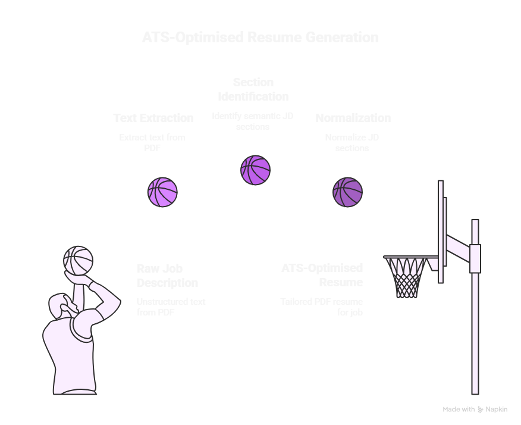
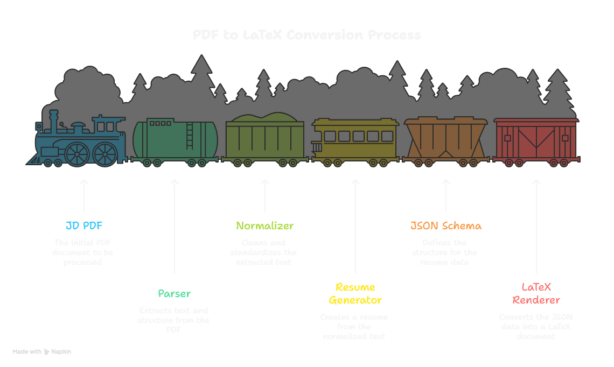
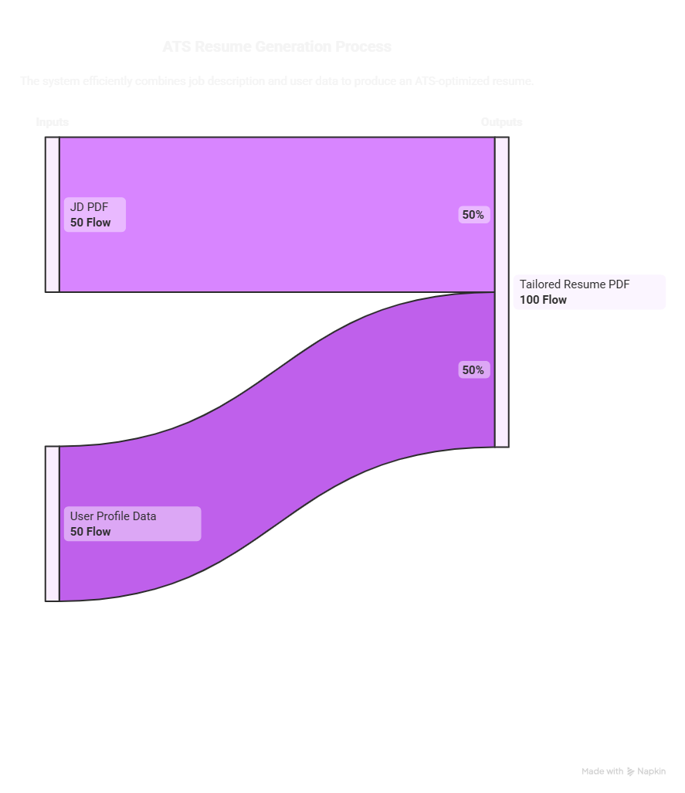
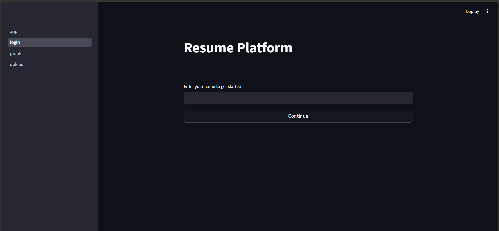
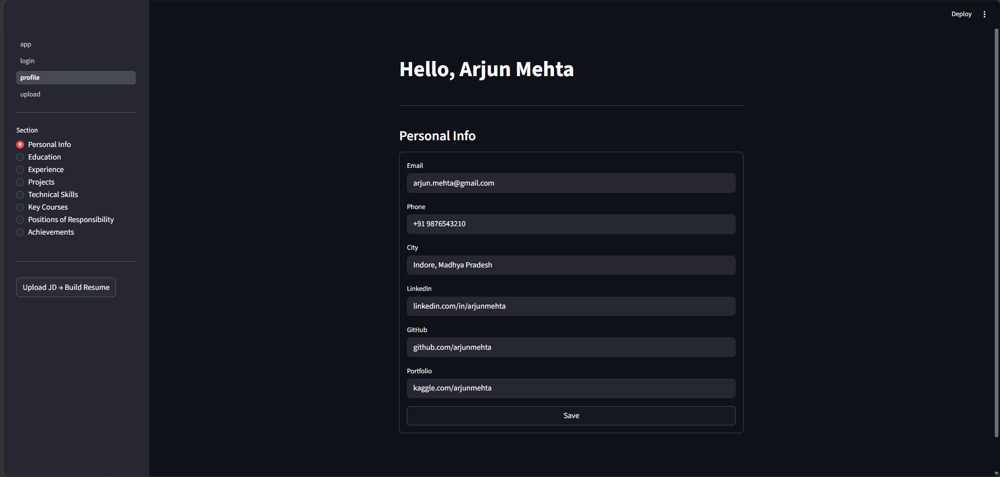
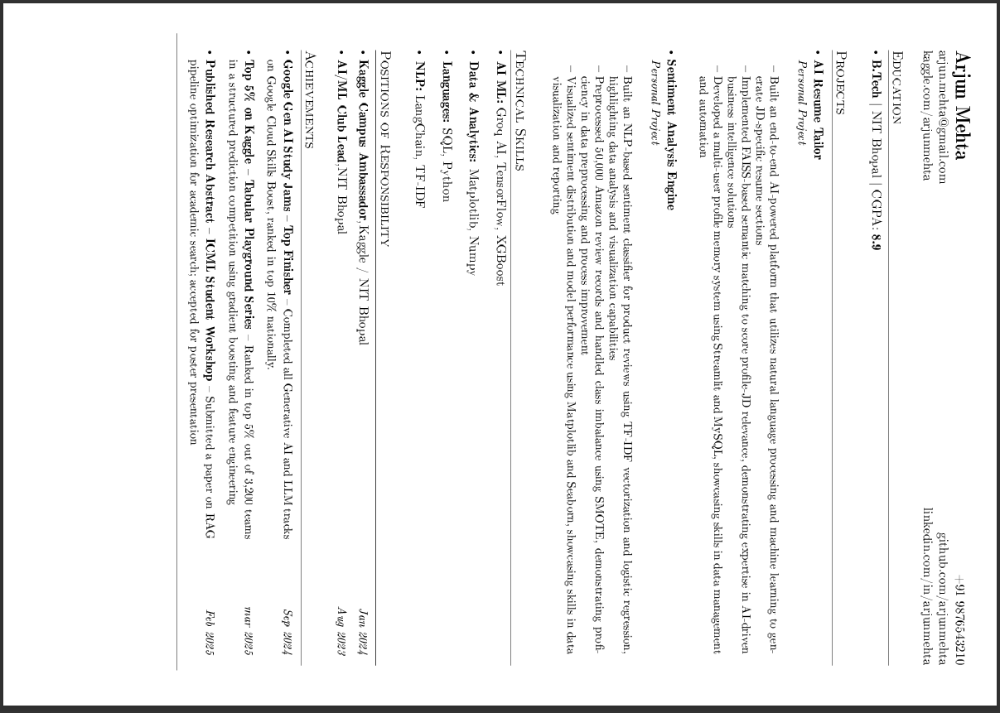

# ResumeForge AI

An AI-assisted, schema-driven resume generation platform that tailors resumes against a Job Description using deterministic parsing, semantic retrieval, structured generation pipelines, and automated LaTeX rendering.

Instead of relying on a single black-box prompt, ResumeForge AI decomposes resume generation into explicit, inspectable stages, combining rule-based systems, retrieval pipelines, local and hosted LLMs, and deterministic document rendering.

> Job Description normalization runs through Ollama + Llama 3.2, while section-wise resume generation is handled via Groq-hosted LLMs.

---

## Demo


---

# Overview

Most resume builders either:
- force users to manually rewrite resumes for every role, or
- delegate everything to a single opaque LLM prompt.

ResumeForge AI takes a different approach.

## High-Level Pipeline



The system maintains a structured, persistent professional profile for each user and intelligently tailors resume sections against a given Job Description through:
- semantic parsing
- retrieval-aware orchestration
- section-specific prompting
- structured intermediate schemas
- deterministic PDF rendering

The renderer never consumes raw LLM output directly.  
All generated content is first normalized into a structured schema before compilation.

---

# System Architecture



---

# Pipeline in Detail

## Stage 1 — JD Parsing

- `pypdf` extracts raw text from uploaded Job Description PDFs
- Unicode-safe parsing pipeline
- Output saved as:

```text
processing_files/output.txt
```

---

## Stage 2 — RegEx Section Extraction

The extracted JD text is segmented into semantic sections using:
- heading detection
- pattern matching
- rule-based parsing

Examples:
- Technical Skills
- Experience
- Requirements
- Responsibilities

Output:

```text
raw_jd_sections.json
```

---

## Stage 3 — LLM-Based JD Normalization

Raw extracted sections are normalized using:
- Ollama
- Llama 3.2

The normalizer:
- restructures inconsistent JD formats
- merges semantically similar sections
- maps content into resume-relevant categories
- preserves ATS keywords

Output:

```text
normalized_jd_sections.json
```

---

# Multi-Model AI Pipeline

ResumeForge AI intentionally separates:
- understanding tasks
- retrieval tasks
- generation tasks
- rendering tasks

Different models are used for different responsibilities.

### Local LLMs (Ollama + Llama 3.2)
Used for:
- semantic cleanup
- JD normalization
- structure alignment

### Groq-hosted LLMs
Used for:
- high-speed section-wise resume generation
- contextual rewriting
- ATS-focused phrasing

This separation improves:
- controllability
- observability
- modularity
- debugging

---

# Semantic Alignment Engine

After resume generation, the system computes semantic similarity between:
- the uploaded Job Description
- the generated tailored resume

using:
- Sentence Transformers embeddings
- FAISS vector similarity search

The resulting score acts as:
- a resume-to-JD relevance metric
- a tailoring quality estimate
- an ATS alignment approximation

Future extensions include:
- section-wise similarity scoring
- missing-skill detection
- retrieval-guided regeneration
- improvement recommendations

## Semantic Alignment Flow



---


# Schema-Driven Resume Architecture

One of the core architectural decisions in ResumeForge AI is the use of a canonical intermediate resume schema.

```text
LLM Output
    ↓
Structured Resume JSON Schema
    ↓
Rendering Engine
```

This schema decouples:
- AI generation
- formatting
- rendering
- template design

Benefits:
- deterministic rendering
- reusable templates
- future DOCX / HTML support
- renderer independence
- easier debugging

The final renderer never directly consumes raw LLM output.

---

# Resume Generation Pipeline

`resume_builder.py` orchestrates section-wise generation.

Each section has its own dedicated generator:

```text
sections_content_builder/
├── skills.py
├── experience.py
├── projects.py
├── courses.py
└── positions.py
```

Each generator:
1. Fetches the relevant JD section
2. Fetches the relevant user profile section
3. Constructs targeted prompts
4. Calls Groq LLM
5. Returns structured formatted text

This section-wise design improves:
- prompt specialization
- controllability
- debuggability
- reduced hallucination risk

---

# Deterministic Rendering Engine

The rendering layer converts structured resume schemas into production-ready PDF resumes.

### Rendering Stack
- Jinja2
- LaTeX
- pdflatex

### Features
- Custom Jinja2 delimiters to avoid LaTeX syntax collisions
- Recursive LaTeX-safe escaping
- Dynamic section rendering
- Automated `.tex → PDF` compilation
- Per-user output isolation
- Compilation log preservation for debugging

---

# Reliability & Rendering Safety

The rendering system includes multiple safeguards for stability.

### Reliability Features
- Recursive LaTeX escaping for user-generated text
- Missing field tolerant rendering
- Schema validation before compilation
- User-specific output directories
- Persistent LaTeX logs for debugging failed renders
- Deterministic rendering pipeline

---

# Profile Management System

ResumeForge AI includes a persistent structured profile system.

Each user maintains reusable professional memory across:

- Personal Information
- Education
- Experience
- Projects
- Technical Skills
- Key Courses
- Positions of Responsibility
- Achievements

---

# Streamlit Interface

The application uses a multi-page Streamlit interface.

### User Flow

```text
Login → Profile Setup → JD Upload → Resume Generation → PDF Download
```

## User Interface

### Login Page


### Profile Dashboard



### Features
- New user onboarding
- Returning user login
- Full CRUD operations across all profile sections
- Sidebar-based navigation
- Per-user local workspace
- JD upload management
- Resume PDF download

---

# Tech Stack

| Layer | Tools |
|---|---|
| AI / NLP | Ollama, Llama 3.2, Groq API, LangChain |
| Semantic Search | FAISS, Sentence Transformers |
| Parsing | pypdf, RegEx |
| Rendering | Jinja2, LaTeX, pdflatex |
| Backend | Python |
| Database | MySQL |
| UI | Streamlit |
| Validation | Pydantic |
| Config | python-dotenv |

---

# Repository Structure

```text
ResumeForgeAI/
│
├── app.py
├── main_pipeline.py
├── generate_resume.py
├── resume_builder.py
├── resume_builder_helper.py
├── parse.py
├── section_extractor.py
├── normalize_sections.py
├── resume_data.json
│
├── pyproject.toml
├── uv.lock
├── README.md
├── .env
├── .gitignore
│
├── templates/
│   └── resume_template.tex
│
├── processing_files/
│   ├── output.txt
│   ├── raw_jd_sections.json
│   └── normalized_jd_sections.json
│
├── prompts/
│   ├── section_normalizer_system.txt
│   └── section_normalizer_human.txt
│
├── sections_content_builder/
│   ├── skills.py
│   ├── experience.py
│   ├── projects.py
│   ├── courses.py
│   └── positions.py
│
├── user/
│   ├── Arjun_Mehta/
│   │   ├── uploads/
│   │   └── outputs/
│   │
│   └── user2/
│
├── pages/
│   ├── 1_login.py
│   ├── 2_profile.py
│   └── 3_upload.py
│
├── db/
│   ├── db_connect.py
│   ├── db_queries.py
│   └── db_setup.py
│
└── output/
```

---

# Getting Started

## 1. Clone Repository

```bash
git clone https://github.com/Vedansh7-7/ResumeForgeAI
cd ResumeForgeAI
```

---

## 2. Create Virtual Environment

```bash
python -m venv venv
```

### Windows

```bash
venv\Scripts\activate
```

### Linux / Mac

```bash
source venv/bin/activate
```

---

## 3. Install Dependencies

```bash
pip install langchain langchain-community langchain-ollama ollama
pip install sentence-transformers faiss-cpu pypdf jinja2
pip install streamlit mysql-connector-python python-dotenv pydantic
pip install groq
```

---

## 4. Install Ollama + Pull Model

Download Ollama:

https://ollama.com

Then pull the model:

```bash
ollama pull llama3.2
```

---

## 5. Configure Environment Variables

Create a `.env` file:

```env
DB_HOST=localhost
DB_USER=root
DB_PASSWORD=your_password
DB_NAME=resume_platform

GROQ_API_KEY=your_groq_api_key
```

---

## 6. Setup Database

```bash
python user/db/db_setup.py
```

---

## 7. Run Application

```bash
streamlit run app.py
```

---

# Current Status

| Component | Status |
|---|---|
| JD PDF Parser | Complete |
| RegEx Section Extraction | Complete |
| LLM JD Normalization | Complete |
| Structured User Profile System | Complete |
| Multi-Page Streamlit UI | Complete |
| Resume JSON Schema | Complete |
| Section-wise Resume Generation | Complete |
| Semantic Similarity Engine (FAISS) | Complete |
| Jinja2 + LaTeX Rendering Engine | Complete |
| Automated PDF Compilation | Complete |

## Generated Resume



---

# Engineering Decisions & Open Discussion

This project intentionally prioritizes:
- modularity
- observability
- deterministic orchestration
- inspectable pipelines

over opaque end-to-end prompting.

---

## Why Section-Wise Generation?

Instead of generating the entire resume in one prompt, the system generates:
- skills
- experience
- projects
- courses
- PORs

independently.

Benefits:
- improved controllability
- easier debugging
- specialized prompts
- lower hallucination risk
- reusable generators

---

## Why Schema-First Rendering?

The structured intermediate schema separates:
- AI generation
- presentation
- rendering

This makes the renderer deterministic and template-independent.

---

## Why Jinja2 + LaTeX Instead of HTML?

The rendering engine prioritizes:
- ATS consistency
- deterministic layouts
- stable PDF generation
- typography control

while accepting the complexity of:
- LaTeX escaping
- template orchestration
- compilation management

---

## Why Separate Normalization From Generation?

JD understanding and resume writing are fundamentally different tasks.

The pipeline intentionally separates:
- semantic cleanup
- structure normalization
- generation

to improve transparency and controllability.

---

## Open Questions & Future Exploration

Some active architectural questions being explored:

- Should retrieval happen before generation or after?
- Would reranking improve section quality?
- Is section-wise prompting superior to agentic generation?
- Should semantic similarity be computed per-section instead of globally?
- Could structured outputs replace regex normalization entirely?

Contributions and discussion are welcome.

---

# Planned Improvements

- Multiple LaTeX resume templates
- Interactive resume editor
- Resume scoring dashboard
- Cover letter generation
- Resume versioning
- FastAPI backend
- Deployment pipeline
- HTML/DOCX export support
- Retrieval-guided regeneration

---

# Media (Coming Soon)

Planned additions:
- System architecture diagrams
- Streamlit walkthrough GIFs
- Resume generation demos
- Before vs after comparisons
- Pipeline screenshots
- Generated PDF samples

---

# License

MIT License
